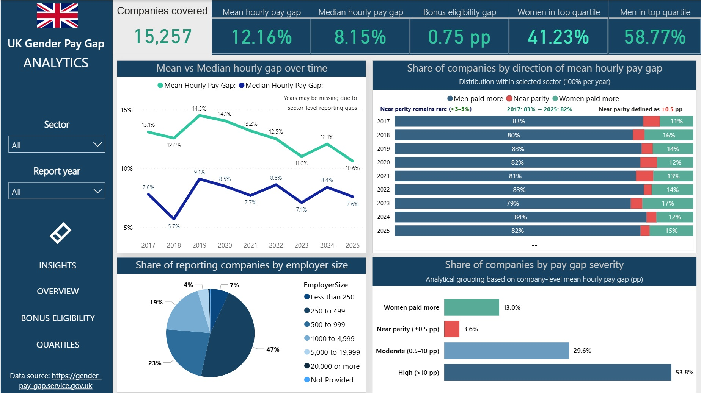

# 🇬🇧 UK Gender Pay Gap — Power BI Analytics

## 📌 Project overview

This **single-page Power BI report** analyzes gender pay inequality in the UK using official government data.
The project focuses on pay gaps, bonus eligibility, and gender representation across pay quartiles, with a strong emphasis on analytical storytelling rather than standalone visuals.

## 🔗 Data source:

UK Government Gender Pay Gap Service:
(https://gender-pay-gap.service.gov.uk/)
________________________________________

## 🎯 Analytical objectives

- The report is designed to answer key questions such as:
- How do mean and median hourly pay gaps evolve over time?
- Does bonus eligibility improve equally for men and women?
- Where does the glass ceiling become visible across pay quartiles?
- Which sectors show structural underrepresentation of women at the top?
- How severe are pay gaps across reporting companies?
________________________________________

## 📊 Key insights

- 📉 Mean pay gaps consistently exceed median gaps, indicating that inequality is driven by top earners rather than the typical employee.
- 💰 Bonus eligibility gaps persist over time, even when overall eligibility increases.
- 🧱 Vertical segregation is clearly visible: women are overrepresented in lower pay quartiles and underrepresented in the top quartile.
- 🏭 Sectoral differences are significant.
- ⚖️ True pay parity is rare; most companies fall into moderate or high pay gap categories.
________________________________________

## 🧠 Analytical approach

- Single-page layout to support comparative analysis and narrative flow
- Dynamic slicing by sector and reporting year
- Separation of distributional effects (median) and structural inequality (mean)
- Use of Top / Bottom sector analysis to highlight extremes rather than averages
________________________________________

## 🛠️ Tools & techniques

- Power BI
- DAX measures for percentages, gaps, and distributions
- Interactive slicers and bookmarks
- Focus on decision-oriented metrics instead of descriptive charts
________________________________________

## 📐 Why a single-page report?

All insights are intentionally kept on one canvas to:
- Reduce cognitive load
- Enable rapid comparison across dimensions
- Support executive-level interpretation without navigation friction
________________________________________

## 📷 Report Preview

### Executive Overview — UK gender pay gap at a glance

### Bonus Eligibility — gender gaps in bonus access and outcomes

### Pay Quartiles — gender representation at different pay levels

## 📎 Notes
This project uses publicly available UK government data and is intended for analytical and educational purposes.

## 🔗 Interactive Power BI report:
(https://app.powerbi.com/view?r=eyJrIjoiN2ZjNmFhMjctMzg0ZS00MjJiLWJmNjUtMjcwZWY1MTZjMWVkIiwidCI6IjY1NWVhZjVhLTBhMTctNDEzOS05NzU5LTFlMDIzMTRkMDJhYiIsImMiOjZ9)
